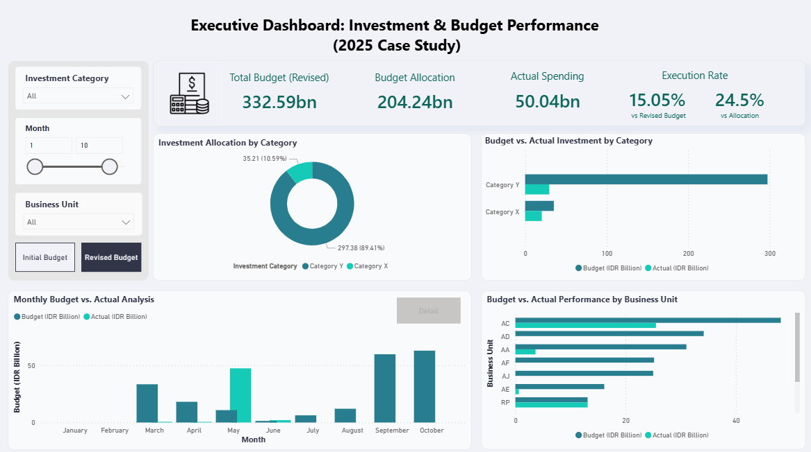
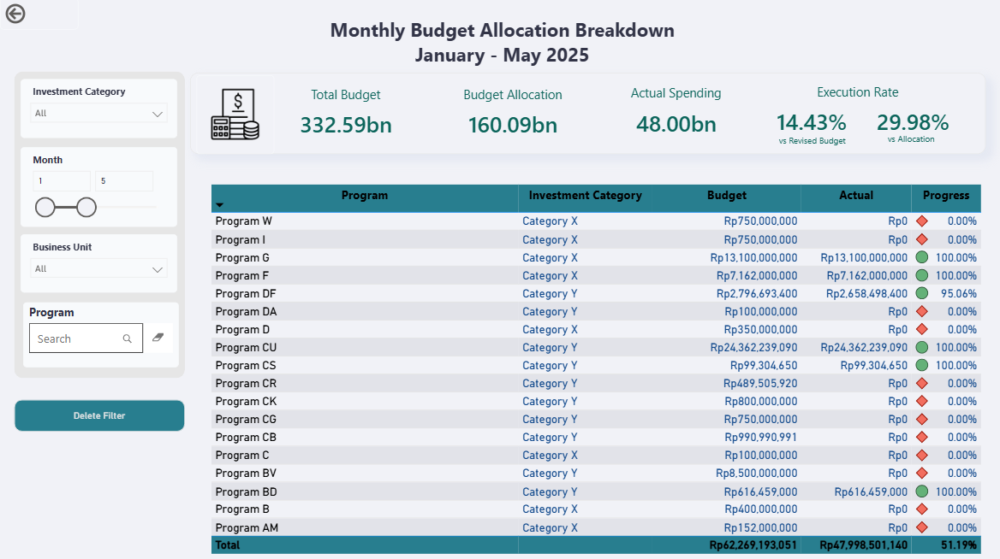
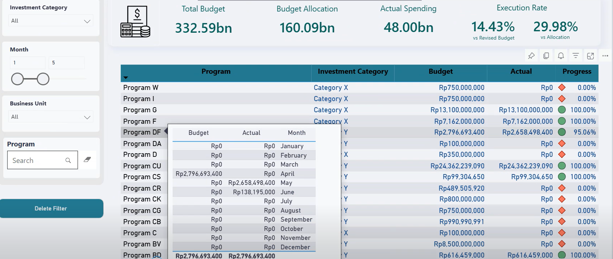

# Executive Dashboard: Investment & Budget Performance Monitoring (2025 Case Study)

## Project Overview

This project presents an executive-level dashboard designed to monitor **investment allocation, budget utilization, and spending performance** across different business units.

The dashboard provides decision-makers with clear insights into how investment budgets are allocated, how much has been spent, and how efficiently the budget is being executed over time.

The dataset used in this project is **anonymized and modified for portfolio purposes** to ensure no confidential corporate information is disclosed.

---

## Dashboard Preview

### Executive Investment & Budget Monitoring Dashboard

This executive dashboard provides a high-level overview of investment allocation, budget utilization, and financial performance across business units.

Key highlights include:

* Total revised budget and actual spending
* Budget execution rate monitoring
* Investment allocation by category
* Monthly spending trend analysis
* Budget performance comparison across business units

The dashboard enables decision-makers to quickly assess whether investment budgets are being utilized effectively.

---

### Monthly Budget Allocation Breakdown

This detailed view allows users to drill down into individual investment programs and monitor monthly budget allocation.

Key features:

* Program-level investment tracking
* Category-based budget allocation
* Monthly breakdown of investment spending
* Filtering by investment category and month

This view supports operational teams in identifying underutilized budgets and tracking execution progress across programs.

## Business Problem

Organizations often allocate large budgets for strategic investments and operational programs. However, management teams frequently face challenges such as:

* Limited visibility into **budget allocation vs actual spending**
* Difficulty identifying **underperforming investment categories**
* Lack of insights into **which business units are effectively utilizing budgets**
* Delayed recognition of **low budget absorption rates**

This dashboard was developed to help stakeholders **monitor investment performance and support data-driven financial decisions.**

---

## Objectives

The primary objectives of this project are:

* Monitor **total investment budget and actual spending**
* Analyze **budget execution rates**
* Compare **planned budget vs actual spending**
* Identify **investment distribution across categories**
* Track **monthly spending trends**
* Evaluate **budget utilization by business unit**

---

## Dashboard Features

### 1. Executive KPI Overview

Provides a quick summary of financial performance including:

* Total Budget (Revised)
* Budget Allocation
* Actual Spending
* Budget Execution Rate

These KPIs help executives quickly assess **overall financial performance and budget absorption.**

---

### 2. Investment Allocation by Category

A visual breakdown of how investment budgets are distributed across different categories.

Purpose:

* Identify which investment categories dominate budget allocation
* Support strategic investment planning

---

### 3. Budget vs Actual Investment by Category

Compares planned budgets with actual spending across investment categories.

Purpose:

* Detect **under-utilized or over-utilized investment categories**
* Monitor investment execution efficiency

---

### 4. Monthly Budget vs Actual Analysis

Displays spending trends over time.

Purpose:

* Identify **seasonal spending patterns**
* Track **budget absorption progress throughout the year**

---

### 5. Budget Performance by Business Unit

Analyzes budget allocation and spending across different business units.

Purpose:

* Evaluate **budget efficiency across departments**
* Identify units with **high or low spending performance**

---

### 6. Detailed Program-Level Breakdown

Provides a detailed table of individual investment programs including:

* Program name
* Investment category
* Budget allocation
* Actual spending
* Execution progress

Purpose:

* Enable **drill-down analysis**
* Support **operational-level monitoring**

---

## Key Insights

Based on the dashboard analysis:

1. **Category Y dominates investment allocation**, representing the majority of total budget distribution.
2. The **overall budget execution rate remains relatively low**, indicating that a significant portion of allocated budgets has not yet been utilized.
3. Spending activity appears to **increase toward the later months of the year**, suggesting delayed investment execution.
4. Some business units receive large budget allocations but show **relatively low spending levels**, highlighting potential inefficiencies.

---

## Business Implications

The insights generated from this dashboard can support management decisions such as:

* Improving **budget monitoring and financial control**
* Identifying **underperforming investment programs**
* Optimizing **budget allocation strategies**
* Ensuring **better utilization of strategic investment funds**

---

## Tools & Technologies

* **Power BI** – Dashboard development and interactive data visualization
* **DAX (Data Analysis Expressions)** – KPI calculations, dynamic measures, and data modeling
* **Microsoft Excel** – Primary data source used for storing and organizing the investment and budget dataset
* **Python (Pandas)** – Data anonymization and masking to remove sensitive information before analysis
* **Data Modeling** – Calendar table creation, relationships, and time-based analysis
* **Data Visualization** – Executive-level dashboard design for business decision support

---

## Data Disclaimer

All datasets used in this project have been **anonymized and modified** for portfolio purposes.
Company names, categories, and financial figures do **not represent any real organization's confidential data.**

---
